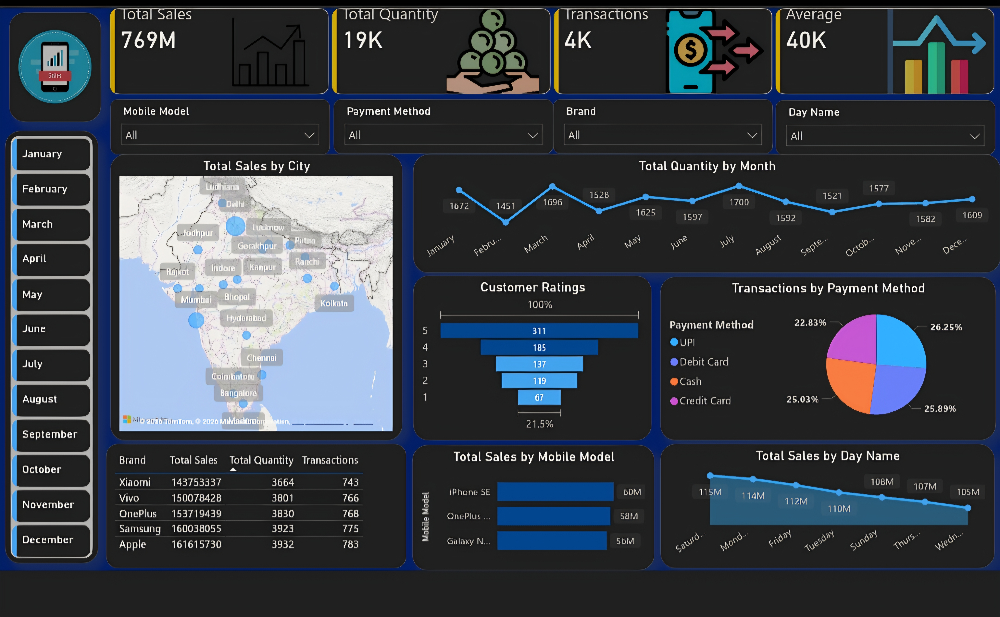

# Dynamic Business Intelligence Dashboard for Retail Sales Analysis

An interactive Power BI dashboard designed to analyze retail sales performance, transactions, product trends, customer ratings, and sales patterns through clear and interactive visualizations.

## Project Overview

This project presents an interactive Power BI dashboard created to transform retail sales data into meaningful business insights.

The dashboard provides an executive-style overview of sales performance using KPI cards, charts, tables, and interactive filters.

It helps users analyze sales trends, product performance, customer behavior, payment methods, and other important business metrics.

## Key Features

- Interactive Power BI sales dashboard
- Total Sales KPI
- Total Quantity KPI
- Transactions KPI
- Average Sales KPI
- Sales performance analysis
- Product-wise sales analysis
- Monthly sales trend analysis
- Customer ratings analysis
- Payment method analysis
- Brand-wise sales and quantity analysis
- City-wise sales analysis
- Day-wise sales analysis
- Interactive slicers and filters
- Executive-style dashboard design

## Technologies Used

### Data Visualization & Business Intelligence

- Microsoft Power BI
- Power BI Desktop
- Data Visualization
- Business Intelligence

### Data Analysis

- Data Cleaning
- Data Analysis
- KPI Development
- Interactive Dashboard Design
- Data Storytelling

## Dashboard Overview

The dashboard provides an interactive overview of retail sales performance through multiple visualizations and key performance indicators.

Users can apply filters and slicers to analyze the data according to different categories and business requirements.

The dashboard includes:

- Sales performance KPIs
- Product and brand analysis
- Sales trends over time
- Customer ratings
- Payment method distribution
- Geographical sales analysis
- Quantity and transaction analysis

## Key Insights

- Overall sales performance can be monitored through KPI cards.
- Sales trends help identify changes in business performance over time.
- Product and brand analysis helps compare the performance of different products.
- Payment-method analysis provides insights into transaction preferences.
- Customer ratings help understand customer satisfaction.
- City-wise analysis provides a geographical view of sales performance.
- Day-wise analysis helps identify sales patterns across different days.
- Interactive filters allow users to explore specific segments of the retail sales data.

## Interactive Dashboard Features

The dashboard includes interactive slicers and filters that allow users to dynamically analyze the retail sales data.

Users can filter and explore the dashboard based on available categories and business dimensions.

This makes the dashboard useful for exploring different sales patterns and identifying business insights from the data.

## Project Objective

The objective of this project is to transform retail sales data into an interactive business intelligence dashboard that helps users understand sales performance, product trends, customer behavior, and transaction patterns.

The project demonstrates how Power BI can be used to convert raw data into meaningful, interactive, and visually accessible business insights.

## Skills Demonstrated

- Power BI
- Power BI Desktop
- Data Analysis
- Data Visualization
- Business Intelligence
- Dashboard Design
- KPI Development
- Interactive Slicers
- Data Storytelling
- Business Analytics

## Dashboard Preview

## Project Files

- `Retail_Sales_Analysis.jpg` — Dashboard preview

## Project Status

The interactive retail sales dashboard has been created and designed to provide a clear overview of sales performance, product trends, customer behavior, and transaction patterns.

## Author

**Nandini Anil Shende**

B.Tech Information Technology  
Kavikulguru Institute of Technology and Science, Ramtek  
Nagpur, Maharashtra, India
